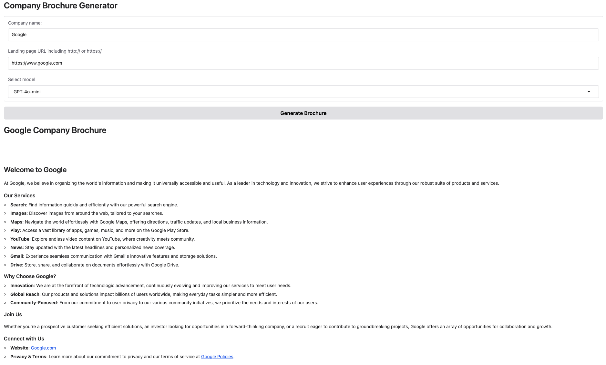
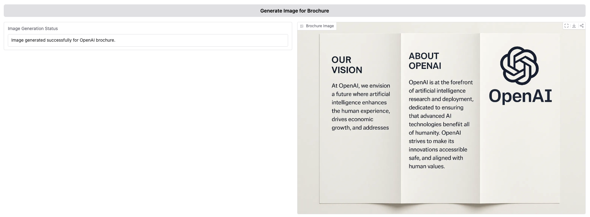

# :computer: Brochure Generator from Website URL

This app uses **OpenAI APIs** to summarize and create a brochure given a website URL. The app also enables the user to create a professional looking brochure in different styles from the created text using **OpenAI Image APT**


## :toolbox: Tech Stack

- :snake: Python
- :brain: OpenAI
- :ladder: Gradio
- :satellite: Beautiful Soup

## :wrench: Setup

The requirements.txt file provides the necessary python dependancies for the project. Create a virtual environment to avoid conflicts. For macOS, please execute the following commands to setup the virtual environment.

```
python -m venv venv
source venv/bin/activate
pip install -r requirements.txt
```

## :shopping_cart: App Deployment

The app can be used by running python app.py. Don't forget to add your OPENAI KEY to the .env file. The app has two sections. The first section generates the markdown of the brochure.



The second section generates the image from the markdown.



Feel free to :star: and clone this repo :sunny:

